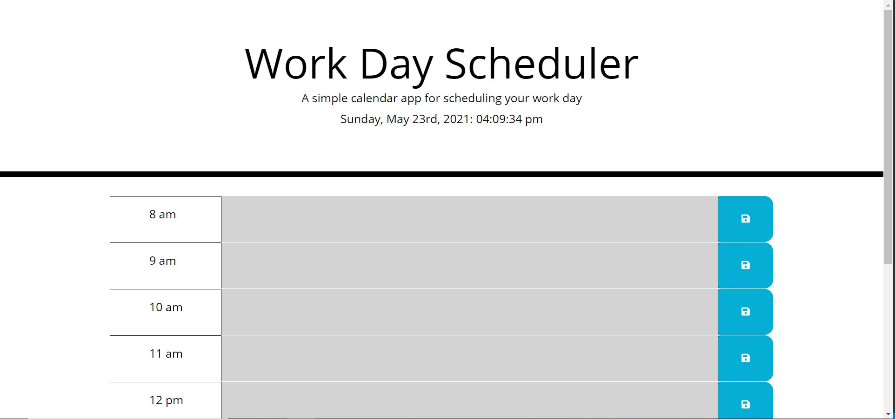

# work-day-scheduler

## Purpose
This website provides a work day scheduler that provides a textbox entry for every hour from 8 am to 5 pm. The user can use these textboxes to record meetings, tasks, or other responsibilities that they have scheduled for that day. The textboxes change colors depending on the time of day, with past hours being gray, present hour being red, and the future hours being green. The user can save their entries and write over them whenever they see fit. The scheduler always displays the current date and even provides the time down to the second, with time updating every second. 

## Built with
    * HTML
    * CSS
    * JQuery
    * Bootstrap
    * Moment.JS
## Website
 https://kdchurch1994.github.io/work-day-scheduler/

 ## Image
    
 ## Contribution
 Made By Kyle Church